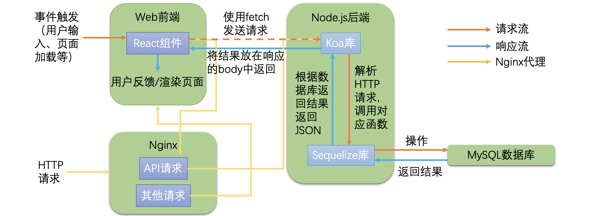
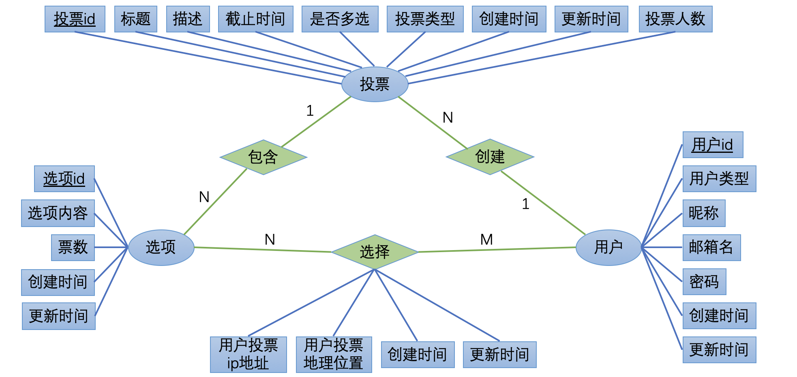

# 数据库引论 课程项目 - voteLine投票应用

项目源码及README已上传至Github：

* 前端部分：[voteLine-frontend](https://github.com/CLDXiang/voteLine-frontend)
* 后端部分：[voteLine-backend](https://github.com/CLDXiang/voteLine-backend)

## <font color=#2E86C1>目录</font>

**1. 总体架构**

&emsp;&emsp;1.1 前端主要技术栈

&emsp;&emsp;1.2 后端主要技术栈

&emsp;&emsp;1.3 数据库

&emsp;&emsp;1.4 代理服务器

&emsp;&emsp;1.5 数据交互概要图示

**2. 数据库设计**

&emsp;&emsp;2.1 表结构

&emsp;&emsp;2.2 ER图

**3. 使用场景及实现细节**

&emsp;&emsp;3.1 UI界面

&emsp;&emsp;3.2 注册

&emsp;&emsp;3.3 登录

&emsp;&emsp;3.4 发起投票

&emsp;&emsp;3.5 搜索投票

&emsp;&emsp;3.6 删除投票

&emsp;&emsp;3.7 获取某一投票信息

&emsp;&emsp;3.8 投票

**4. 技术难点**

&emsp;&emsp;4.1 数据库设计

&emsp;&emsp;4.2 后端实现语言的选择

&emsp;&emsp;4.3 外键的完整性约束体会

&emsp;&emsp;4.4 下拉自动加载投票列表的实现

&emsp;&emsp;4.5 Nginx部署

**5. 简短的总结**

**6. 附录**

&emsp;&emsp;6.1 工程结构

&emsp;&emsp;6.2 外部资源

## <font color=#2E86C1>1. 总体架构</font>

标准的C/S架构，采用商业级标准构建的用户交互界面，前后端数据库分离的架构模式，服务端在Nginx上部署。

### <font color=#17A589>1.1 前端主要技术栈：</font>

* Web应用，使用html+css+JS编写。
* 基于[React](https://reactjs.org/)，用于构建用户界面的JavaScript库
* 路由跳转实现由[React Router](https://github.com/ReactTraining/react-router)提供。
* 部分基础组件来自[Ant Design](https://ant.design)，基于蚂蚁金服服务于企业级产品的设计体系Ant Design的React组件库
* 统计结果可视化基于[AntV](https://antv.alipay.com)，蚂蚁金服全新一代数据可视化解决方案
* 用户登录状态由HTML5 WebStorage解决方案维护（作用类似Cookies）

### <font color=#17A589>1.2 后端主要技术栈：</font>

* 使用[Node.js](https://nodejs.org/)编写
* 与前端的数据交互使用[Koa](https://koa.bootcss.com/)库，基于Node.js平台的下一代web开发框架
* 采用[Sequelize](https://github.com/sequelize/sequelize)库实现对MySQL数据库的操作

### <font color=#17A589>1.3 数据库：</font>

* MySQL

### <font color=#17A589>1.4 代理服务器：</font>

* Nginx

### <font color=#17A589>1.5 数据交互概要图示：</font>



## <font color=#2E86C1>2. 数据库设计</font>

### <font color=#17A589>2.1 表结构</font>

共有四个表：用户users，投票investigations，选项options，选择chooses。

约束说明：PK：Primary Key，NN：Not Null，UQ：Unique，FK：Foreign Key

#### 2.1.1 用户users表

| 属性 | 数据类型 | 说明 | 约束 |
| --- | --- | --- | --- |
| uid | BIGINT(20) | 用户id | PK, NN, UQ |
| utype | VARCHAR(10) | 用户类型：root管理员/normal普通会员/visitor游客 | NN |
| nickname | VARCHAR(32) | 用户昵称 | NN, UQ |
| email | VARCHAR(64) | 用户邮箱名 | NN, UQ |
| password | VARCHAR(32) | 双重加密后的密码 | NN |
| createdAt | DATETIME | 创建时间 | NN |
| updatedAt | DATETIME | 最后更新时间 | 无 |

#### 2.1.2 投票investigations表

| 属性 | 数据类型 | 说明 | 约束 |
| --- | --- | --- | --- |
| iid | BIGINT(20) | 投票id | PK, NN, UQ |
| title | VARCHAR(45) | 投票标题 | NN |
| description | VARCHAR(255) | 投票描述 | 无 |
| timeend | DATETIME | 截止时间 | NN |
| multiple | TINYINT(4) | 是否为多选 | NN |
| itype | VARCHAR(20) | 投票类型：discuss热点讨论/question问卷调查/activity活动投票/others杂七杂八 | NN |
| createrUid | BIGINT(20) | 创建用户uid | NN, FK(uesrs.uid) |
| createdAt | DATETIME | 创建时间 | NN |
| updatedAt | DATETIME | 最后更新时间 | 无 |
| votercount | BIGINT(10) | 投票人数 | NN |

#### 2.1.3 选项options表

| 属性 | 数据类型 | 说明 | 约束 |
| --- | --- | --- | --- |
| oid | BIGINT(20) | 选项id | PK, NN, UQ |
| content | VARCHAR(45) | 选项内容 | NN |
| number | BIGINT(10) | 票数 | NN |
| iid | BIGINT(10) | 对应投票id | NN, FK(investigations.iid) |
| createdAt | DATETIME | 创建时间 | NN |
| updatedAt | DATETIME | 最后更新时间 | 无 |

#### 2.1.4 选择chooses表

| 属性 | 数据类型 | 说明 | 约束 |
| --- | --- | --- | --- |
| uid | BIGINT(20) | 用户id | PK, NN |
| oid | BIGINT(20) | 选项id | PK, NN |
| createdAt | DATETIME | 创建时间 | NN |
| updatedAt | DATETIME | 最后更新时间 | 无 |
| ip | VARCHAR(45) | 用户投票ip地址 | NN |
| region | VARCHAR(45) | 用户投票地理位置 | 无 |

### <font color=#17A589>2.2 ER图</font>



## <font color=#2E86C1>3. 使用场景及实现细节</font>

voteLine是一个Web投票应用，用户可以发起自己的投票，也可以参与别人的投票，热门投票将以列表形式展示在首页。

这个应用实现了简洁美观的UI界面，并且对于用户的多数操作都有包括顶部弹出消息等形式的即时反馈，对用户相当友好。

以下内容介绍使用场景及实现细节，其中数据库操作部分使用的表对象定义请参看第2节中的表结构定义。

### <font color=#17A589>3.1 UI界面</font>

前端不是这门课程的核心，所以仅简单介绍一下界面。


首页的UI设计见上图，搜索结果页面类似首页的右侧展示区，投票结果页面主体是可视化的数据图，其他页面的主体基本是表单。

前端页面结构及功能简述如下；

```
- 首页(/)
    - 头部导航栏：功能见2.1.1
    - 左侧功能区：功能见2.1.2
    - 右侧展示区：功能见2.1.3
- 登录页面(/login)
    - 头部导航栏
    - 登录表单：除了登录表单外，还有前往注册页面的超链接，登录成功会自动返回首页
- 注册页面(/register)
    - 头部导航栏
    - 注册表单：除了注册表单外，还可以查看用户协议，注册成功会自动返回登录页面
- 发起投票页面(/newinv)
    - 头部导航栏
    - 新建投票表单：可以自由添加选项个数，发起投票成功会自动跳转至该投票页面
- 投票页面(/inv/:iid)
    - 头部导航栏
    - 投票内容区：包括投票标题、描述、创建人昵称、创建时间等信息，还有个按钮可以跳转到投票结果页面
    - 投票表单：投票成功后会自动跳转到投票结果页面，如果当前用户已经投过票则表单会变为不可用状态，显示上次投票的选择
- 投票结果页面(/inv/:iid)
    - 头部导航栏
    - 投票内容区：同上，但按钮用来跳转回投票页面
    - 投票结果图：利用AntV的条形图展示投票结果，将鼠标移至条上可以显示具体信息，效果图见2.1.4
- 搜索结果页面(/search:/pattern)
    - 头部导航栏
    - 搜索结果列表：类似首页右侧展示区
```

#### 3.1.1 头部导航栏

头部导航栏从左到右依次为Logo，首页超链接，搜索框，用户信息。

* 点击首页超链接会跳转到首页。
* 搜索框在输入内容后点击搜索图标或按下回车即可跳转到搜索结果页面。
* 用户信息在未登录状态下点击会跳转到登录界面，登录状态下点击会显示子菜单，目前子菜单中仅有退出登录功能。

#### 3.1.2 首页左侧功能区

用于跳转至其他交互页面，目前仅实现了发起投票功能。未登录状态下点击发起投票会跳转至登录界面，否则跳转至发起投票界面。

#### 3.1.3 首页右侧展示区

根据投票类型不同分成了4个标签页，每个标签页展示对应类别投票的列表。

对列表中每一个投票，有标题、描述和下方功能区，其中：

* 标题：点击即可跳转至对应投票页面
* 下方功能区：目前仅实现了删除功能，点击后会出现提示框，确认后验证用户权限，如果有权删除则删除投票。此外还会显示该投票的投票人数。

列表并不会一次加载完，每次拖动到底部就会向后端再请求几条投票的信息并自动添加到列表。

#### 3.1.4 投票结果页效果图


### <font color=#17A589>3.2 注册</font>

功能：注册新用户

#### 3.2.1 注册——前端事件响应

1. **用户填写表单**：表单会自动检查每一项是否符合规则（邮箱格式，是否为空等），如果符合所有要求则继续，否则会在输入位置显示提示信息；
2. **检查表单**：确认两次输入密码是否相同，以及用户是否勾选同意用户协议等，若均符合则继续，否则显示顶部提示信息；
3. **发送表单**：向后端发送带有JSON对象的POST请求，JSON对象内容见下表：

| 键 | 说明 |
| --- | --- |
| email | 邮箱名 |
| password | 密码，在此处会经过md5(md5+盐)双重加密 |
| nickname | 用户昵称 |

#### 3.2.2 注册——后端响应请求并操作数据库

后端响应的JSON对象内容：

| 键 | 说明 |
| --- | --- |
| existingEmail | 邮箱名是否已被注册 |
| existingNickname | 用户昵称是否已被注册 |
| success | 数据库操作是否成功 |

1. **查找邮箱名是否已被注册**：在users表找`{email:email}`的user，若找到则设`existingEmail=true`；
2. **查找用户昵称是否已被注册**：在users表找`{nickname:nickname}`的user，若找到则设`existingNickname=true`；
3. **找出最大uid**：若均未被注册，在users表找出`max(uid)`；
4. **插入新用户**：在users表中插入`{uid:max(uid)+1, utype:'normal', nickname:nickname, email:email, password:password}`，若成功设`success=true`；
5. **返回响应**：将响应返回前端。

#### 3.2.3 注册——前端反馈

若有`existingEmail`，则显示顶部提示信息“注册失败，邮箱已被注册！”，`existingNickname`同理。

若`success`则显示顶部提示信息“注册成功，马上登录吧！”，并跳转至登录界面。

### <font color=#17A589>3.3 登录</font>

功能：用户登录

#### 3.3.1 登录——前端事件响应

1. **用户填写表单**：表单会自动检查每一项是否符合规则（邮箱格式，是否为空等），如果符合所有要求则继续，否则会在输入位置显示提示信息；
2. **发送表单**：向后端发送带有JSON对象的POST请求，JSON对象内容见下表：

| 键 | 说明 |
| --- | --- |
| email | 邮箱名 |
| password | 密码，在此处会经过md5(md5+盐)双重加密 |

#### 3.3.2 登录——后端响应请求并操作数据库

后端响应的JSON对象内容：

| 键 | 说明 |
| --- | --- |
| success | 数据库操作是否成功 |
| wrongEmail | 邮箱不存在 |
| wrongPwd | 密码不正确 |
| nickname | 用户昵称 |
| userType | 用户类型 |
| uid | 用户id |

1. **查找邮箱名是否存在**：在users表找`{email:email}`的user，若找不到则设`wrongEmail=true`；
2. **匹配密码**：若邮箱名存在，在users表找`{email:email, password:password}`的user，若找不到则设`wrongPwd=true`，若找到，则将找到的用户属性放入响应结果中，并设`success=true`；
3. **返回响应**：将响应返回前端。

#### 3.3.3 登录——前端反馈

若有`wrongEmail`，则显示顶部提示信息“登录失败，邮箱未注册！”，`wrongPwd`同理。

若`success`则将`uid`,`userType`,`nickname`保存在`WebStorage.sessionStorage`（登录状态维护）中，并显示顶部提示信息“欢迎回来！XXX”，然后跳转至首页。

### <font color=#17A589>3.4 发起投票</font>

功能：创建新的投票

#### 3.4.1 发起投票——前端事件响应

1. **用户填写表单**：表单会自动检查每一项是否符合规则（是否为空等），如果符合所有要求则继续，否则会在输入位置显示提示信息；
2. **检查表单**：确认是否有至少两个选项，若是则继续，否则显示顶部提示信息；
3. **发送表单**：向后端发送带有JSON对象的POST请求，JSON对象内容见下表：

| 键 | 说明 |
| --- | --- |
| title | 投票标题 |
| description | 投票描述 |
| timeEnd | 截止日期，为Date对象 |
| multiple | 是否为多选 |
| itype | 投票类型 |
| createrUid | 创建者的uid |
| options | 选项，为一个数组，每个元素为字符串 |

#### 3.4.2 发起投票——后端响应请求并操作数据库

后端响应的JSON对象内容：

| 键 | 说明 |
| --- | --- |
| success | 数据库操作是否成功 |
| iid | 新建投票的iid |

1. **找出最大iid**：在investigations表找`max(iid)`；
2. **插入新投票**：在investigations表中插入`{iid: max(iid) + 1, title: title, description: description, timeend: timeEnd, multiple:multiple, itype: itype, createruid: createrUid, votercount: 0}`，若成功设`success=true, iid=新建投票的iid`；
3. **找出最大oid**：若上一步成功，在options表找`max(oid)`，记为`maxOid`；
4. **逐个写入选项**：遍历传来的options，每次将`maxOid++`，逐个在options表中插入`{oid: maxOid, content: options[i], number: 0, iid: 新建投票的iid}`，若发生错误则设`success=false`；
5. **返回响应**：将响应返回前端。

#### 3.4.3 发起投票——前端反馈

若`success`，则显示顶部提示信息“发起投票成功！”，并跳转至新发起的投票页面。否则显示“发起投票失败”。

### <font color=#17A589>3.5 搜索投票</font>

功能：1. 加载首页投票列表；2. 实现搜索指定投票功能（模糊匹配）

#### 3.5.1 搜索投票——前端事件响应

1. **触发：加载首页列表/用户搜索**：加载首页列表其实就是不带搜索字段的搜索，下面以搜索为例，用户输入一个搜索字段pattern，按下搜索后触发请求；
2. **发送请求**：向后端发送带有对象的POST请求，JSON对象内容见下表：

| 键 | 说明 |
| --- | --- |
| count | 请求的投票数目，后端将会返回此数目的投票信息 |
| startIndex | 投票列表起始索引，用于切片，详见2.5.2 |
| itype | 投票类型，若为空则返回全部类型 |
| pattern | 搜索字段，若为空则返回全部 |
| orderBy | 排序方式，目前有'new','old','hot'三种，分别为最新创建，最早创建，投票人数最多的靠前 |

#### 3.5.2 搜索投票——后端响应请求并操作数据库

后端响应的JSON对象内容：

| 键 | 说明 |
| --- | --- |
| success | 数据库操作是否成功 |
| results | 投票列表，为一个数组，每一个元素是一个投票对象，包含投票的所有属性 |

1. **按排序方式不同查找所有投票**：
   1. 在investigations表找满足条件的投票，此处采用正则表达式实现模糊匹配（LIKE也可以），具体规则是：`itype`属性匹配`"${itype}.*"`，这样主要是为了实现空字符串`''`匹配全部类型；`title`属性匹配`".*${pattern}.*"`，即匹配标题包含`pattern`的所有投票。
   2. 排序方式有三种：`'new'`对应`'ORDER BY createdAt DESC'`，`'old'`对应`'ORDER BY createdAt'`，`'hot'`对应`'votercount DESC, createdAt DESC'`，即先按投票人数排序再按最新发布排序，目前前端默认展示顺序均为`'hot'`。
2. **切片**：对得到的投票列表`invList`切片，设`results=invList[startIndex, startIndex+count]`，若得到的切片不为空则设`success=true`；
3. **返回响应**：将响应返回前端。

#### 3.5.3 搜索投票——前端反馈

若`success`，则将得到的投票列表渲染到展示区末尾，否则说明已经全部加载，显示顶部提示信息“这就是全部了~”。

### <font color=#17A589>3.6 删除投票</font>

功能：删除某一投票，以及与其关联的所有选项及选择记录

#### 3.6.1 删除投票——前端事件响应

1. **触发：用户点击删除按钮并确认**：用户点击删除按钮后会出现确认框，若用户点击确定则继续；
2. **验证用户身份**：若用户既不是管理员也不是投票创建者，则显示顶部消息提示“只能删除自己创建的投票！”，否则继续；
3. **发送请求**：向后端发送带有对象的POST请求，JSON对象内容见下表：

| 键 | 说明 |
| --- | --- |
| iid | 要删除的投票id |

#### 3.6.2 删除投票——后端响应请求并操作数据库

后端响应的JSON对象内容：

| 键 | 说明 |
| --- | --- |
| success | 数据库操作是否成功 |

1. **找到该投票的所有选项**：在options表中找满足`{iid:iid}`的所有选项，记为options；
2. **逐个删除每个选项的所有选择与选项**：对options中的每一个option，在chooses表中删除所有满足`{oid:option.oid}`的选择，然后在options表中删除满足`{oid:option.oid}`的选项；
3. **删除该投票**：在investigations表中删除满足`{iid:iid}`的投票，若以上所有的操作均成功则设`success=true`；
4. **返回响应**：将响应返回前端。

#### 3.6.3 删除投票——前端反馈

若`success`，则在顶部显示提示信息“删除投票成功！”，若当前在投票页面则跳转至首页，若当前在首页则重新渲染投票列表。

### <font color=#17A589>3.7 获取某一投票信息</font>

功能：获取某一投票自身的属性，以及与其关联的所有选项的属性，用于渲染投票页面及投票结果页面等

#### 3.7.1 获取某一投票信息——前端事件响应

1. **触发：进入某一投票页面/inv/:iid**：进入该路由后在渲染页面前发出请求；
2. **发送请求**：向后端发送带有url参数的GET请求，url参数内容见下表：

| 参数 | 说明 |
| --- | --- |
| iid | 要获取的投票id |
| uid | 当前用户的uid，若为游客则为-1 |

#### 3.7.2 获取某一投票信息——后端响应请求并操作数据库

后端响应的JSON对象内容：

| 键 | 说明 |
| --- | --- |
| success | 数据库操作是否成功 |
| wrongIid | 请求的iid不存在 |
| inv | 投票信息，包括该投票的所有属性 |
| options | 选项，为一个数组，包括该投票所有选项的所有属性 |
| createrName | 投票创建人昵称 |
| voted | 当前用户是否给当前投票投过票 |
| votedOptions | 当前用户投票时的选择，为一个数组，每个元素是用户投过的选项的oid |

1. **查找该投票**：在investigations表中查找`{iid:iid}`的投票，若没有查到则设`wrongId=true`，若查到则设`inv=查到的投票对象`并继续；
2. **查找该投票的所有选项**：在options表中查找`{iid:iid}`的所有选项，将其加入到`options`中；
3. **查找该投票的创建人**：在users表中查找`{uid:result.inv.createruid}`，设`createrName=查到的用户的nickname`；
4. **查找当前用户投过哪些选项**：对options中每一个option，在chooses表中查找`{uid:uid, oid:option.oid}`，若找到则将找到的选择的`oid`加入到`votedOptions`中，并设`voted=true`，若以上所有操作均没有报错，则设`success=true`；
5. **返回响应**：将响应返回前端。

#### 3.7.3 获取某一投票信息——前端反馈

1. **错误的iid**：若`wrongIid`，则显示顶部提示信息“该投票不存在！”，然后跳转到首页；
2. **渲染投票页面**：将获得的投票及选项信息以表单形式渲染在投票页面，如果`voted`，即用户已经投过票，则根据`votedOptions`选中选项，并将表单置为不可用状态（灰色，无法交互）；
3. **渲染投票结果页面**：将获得的投票及选项信息以数据统计图形式渲染在投票结果页面。

### <font color=#17A589>3.8 投票</font>

功能：用户投票

#### 3.8.1 投票——前端事件响应

1. **用户填写表单**：用户在投票页面选择选项后点击投票按钮，若用户未登录将会现实顶部提示信息“要先登录才能投票哦！”并跳转至登录页面，否则继续；
2. **检查表单**：若用户没有选选项，显示顶部提示信息“请至少选择一个选项”，否则继续；
3. **发送请求**：向后端发送带有对象的POST请求，JSON对象内容见下表：

| 键 | 说明 |
| --- | --- |
| options | 选项列表，每个元素为用户选择选项的oid |
| uid | 当前用户的uid，若为游客则为-1 |
| ip | 用户当前的ip地址，通过搜狐接口获取 |
| region | 用户当前所在地区，通过搜狐接口获取 |

#### 3.8.2 投票——后端响应请求并操作数据库

后端响应的JSON对象内容：

| 键 | 说明 |
| --- | --- |
| success | 数据库操作是否成功 |
| existingChoose | 已经投过票了 |

这里关于用户是否已经投过票的验证步骤相对复杂一些，先总述一下思路：先用一个`option`找到`iid`，找出该`iid`对应的所有`options`，对找到的每一个`option`，在chooses表中查找`{uid:uid, oid:option.oid}`，若找到则说明投过票了。

1. **查找一个选项**：在options表中查找`{oid:options[0]}`的投票，记为`option_`；
2. **查找该投票的所有选项**：在options表中查找`{iid:option_.iid}`的所有选项，记为`options_`；
3. **查找任一选项是否被用户选择过**：对`options_`中每个选项`option`在chooses表中查找`{uid:uid, oid:option.oid}`，若找到则设`existingChoose=true`；
4. **插入新选择并更新选项**：如用户没有投过票，对`options`中的每个选项`option`，在chooses表中插入`{uid:uid, oid:option, ip:ip, region: region}`，然后通过对options表的查询和更新操作将该选项的`number++`（票数+1）；
5. **更新投票的投票人数**：通过对investigations表的查询和更新操作将该投票的`votercount++`（投票人数+1），若以上操作均成功设`success=true`；
6. **返回响应**：将响应返回前端。

#### 3.8.3 投票——前端反馈

若`success`，则显示顶部提示信息“投票成功！”，然后跳转至投票结果页面，否则若`existingChoose`，现实顶部提示信息“你已经投过票了哦！”。

## <font color=#2E86C1>4. 技术难点</font>

其实绝大多数精力还是放到了前端的实现上，遇到的问题也最多，但是前端并非课程重点，所以在这里不详细列举了。

### <font color=#17A589>4.1 数据库设计</font>

在学习了数据库的设计方法后，虽然做题已经得心应手了，但是实际上手来设计却还是遇到了点问题。比如我在决定做投票系统之后，一开始就遇到了一个问题：**究竟该把哪些东西算作实体？**比如一开始对于“选项”的定位就遇到了这个问题，选项可以作为单独的实体，也可以作为投票的属性。但是后来考虑到SQL中属性的原子性，显然如果我把选项作为属性，就需要给投票提前分配足够的选项的属性（选项1，选项2...），这似乎是很不雅观的实现，于是我就决定把选项独立出来作为一个实体了，在后续的设计中确实证明了这是一个正确的选择。

另外一个问题就是**两个实体间如果有多个关系模式类似的联系，我该保留哪些？**在最初的设计中，在投票和用户之间其实我设计了“创建”、“删除”等等联系，但是随后我发现在转换为关系模式后其实它们几乎是差不多的。这时候外键的思想启发了我，一个投票和用户最初的外键绑定其实是由“创建者id”这一属性决定的，也就是说其实“创建”才是他们之间最关键的联系，而“删除”之类的操作其实在没有必要记录删除记录的情况下并不需要单独作为一个联系提出来。也就是说在判断需要保留哪些联系时，可以使用外键的思想来进行筛选。

此外还有一个问题，**如果某个联系既可以是N:1也可以是N:M，该如何设计ER图？**这个问题出现在我对于“选择”这个联系的设计中，因为我打算实现单选和多选两种不同的投票，所以“选择”也分为了这两种情况。这算是比较容易解决的问题，因为容易发现N:1其实是N:M的子集，所以N:M也包含了N:1的情况，按照N:M模式来进行设计就OK了。

### <font color=#17A589>4.2 后端实现语言的选择</font>

如果要图省事的话完全可以用Python的Flask包搭建后端，但是因为Python操作MySQL的库实在过于底层，导致我在测试时遇到了很多意料之外的麻烦。于是我就开始寻找封装得比较好的MySQL高级库，发现了基于Node的Sequelize库，刚好我一直想要学习Node，这次算是找到了动机，于是就决定用Node来搭后台了。

### <font color=#17A589>4.3 对外键完整性约束的体会</font>

在学习与建立数据库时我一直不是很明白**外键到底是不是真的必要**，但还是顺便设置了，直到我开始写删除投票功能才发现了外键的好处。一开始我试图直接删掉投票，但是却因为有选项依赖它而无法删掉，这是我才意识到其实先删掉选项才是正确的，不然它们会一直作为无效数据留在数据库中。于是最后删除投票就按照外键引用的顺序实现：先删选择->再删选项->再删投票。我在这里充分体会到了数据库设计的严谨性。

### <font color=#17A589>4.4 下拉自动加载投票列表的实现</font>

为了实现这个功能，前端部分就费了我不少功夫，后端部分我则想到了通过记录前端加载了多少数据（startIndex），在请求时将其作为参数传到后端，然后由后端进行切片来实现。

### <font color=#17A589>4.5 Nginx部署</font>

关于Nginx，对我来说最大的问题就在于**Nginx到底是做什么的？**之前并没有接触过服务器部署，网上的介绍也看得云里雾里，干脆先依葫芦画瓢部署着试试吧。结果在设置Nginx配置文件的时候一步步也就明白了Nginx是在做什么了，它的反向代理之类的功能也大致搞明白了，实践出真知啊。

## <font color=#2E86C1>5. 简短的总结</font>

这是我第一次独立完成一个前后端+数据库全栈项目，总共花费了接近五十个小时，其间遇到了很多困难，但是相对的也学到了太多知识，对于平时课程中学到的很多数据库的概念、设计理念等也有了更加深刻的理解。虽然还有很多原本想要的功能没来得及实现，UI也还能弄得更好看一些，但是现在完成的这个基本能用的小应用已经让我成就感满满了！

## <font color=#2E86C1>6. 附录</font>

### <font color=#17A589>6.1 工程结构</font>

#### 6.1.1 voteLine-frontend（前端）

仅展示源码部分，部分配置文件等不在此列出。

```
voteLine-frontend/
|
+- src/ <-- 源码
|  |
.  +- assets/ <-- 图片目录
.  |
.  +- tools/
   |  |
   |  +- encodePassword.js <-- 用于密码加密
   |
   +- App.js/App.css <-- 核心组件，作为应用主节点，并处理路由表
   |
   +- config.js <-- 用户自定义配置文件
   |
   +- index.js <-- 根节点，用于将React组件添加至DOM树
   |
   +- serviceWorker.js <-- create-react-app创建的，用于production场景的优化的脚本
   |
   +- components <-- 组件目录
      |
      +- HeadBar.js/HeadBar.css <-- 头部导航栏组件
      |
      +- HomePage.js/HomePage.css <-- 首页
      |
      +- InvPage.js/InvPage.css <-- 投票/投票结果页面
      |
      +- LoginPage.js/LoginPage.css <-- 登录页面
      |
      +- NewInvPage.js/NewInvPage.css <-- 发起投票页面
      |
      +- RedirectPage.js <-- 用于路由跳转刷新
      |
      +- RegisterPage.js/RegisterPage.css <-- 注册页面
      |
      +- SearchPage.js/SearchPage.css <-- 搜索结果页面
      |
      +- VoteList.js/VoteList.css <-- 投票列表组件
```

#### 6.1.2 voteLine-backend（后端）

仅展示源码部分，部分配置文件等不在此列出。

```
voteLine-backend/
|
+- app.js <-- 后端服务核心模块，用于启动服务并开启端口监听
|
+- config.js <-- 用户自定义配置文件
|
+- controller.js <-- 用于从controllers/目录自动读取并注册路由表
|
+- dbhandler.js <-- 数据库交互核心模块，用于定义数据库表模型并连接数据库
|
+- controllers/ <-- 核心功能模块目录
|  |
.  +- deleteinv.js <-- 处理'POST /api/deleteinv'，即删除投票
.  |
.  +- getinv.js <-- 处理'GET /api/getinv'，即获取投票信息
   |
   +- getinvlist.js <-- 处理'POST /api/getinvlist'，即获取投票列表
   |
   +- login.js <-- 处理'POST /api/login'，即登录
   |
   +- newinv.js <-- 处理'POST /api/newinv'，即新建投票
   |
   +- register.js <-- 处理'POST /api/register'，即用户注册
   |
   +- vote.js <-- 处理'POST /api/vote'，即投票
```

### <font color=#17A589>6.2 外部资源</font>

前端页面背景图片来自[Pixiv](https://www.pixiv.net/member_illust.php?mode=medium&illust_id=62288977)。
